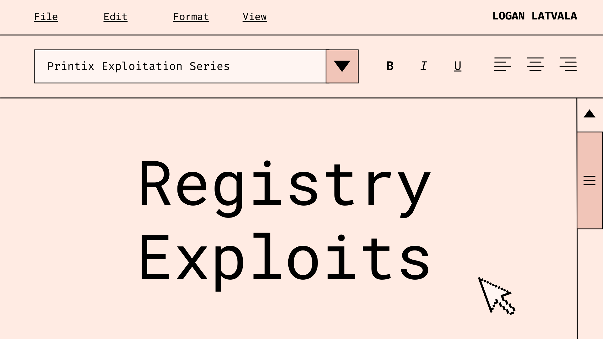

 

  

  <h3 align="center">CVE-2022-25089 </h3>

  

    A system admin's complete nightmare, users changing the registry from anywhere and everywhere without authentication.
     
     
    <a href="https://github.com/ComparedArray/printix-CVE-2022-25089"><strong>Explore the docs »</strong></a>
     
     
    <a href="https://github.com/ComparedArray/printix-CVE-2022-25089">View Demo</a>
    .
    <a href="https://github.com/ComparedArray/printix-CVE-2022-25089/issues">Report Bug</a>
    .
    <a href="https://github.com/ComparedArray/printix-CVE-2022-25089/issues">Request Feature</a>
  

     

## Table Of Contents

* [About the Project](#about-the-project)
* [Built With](#built-with)
* [Getting Started](#getting-started)
  * [Prerequisites](#prerequisites)
  * [Installation](#installation)
* [Usage](#usage)
* [Roadmap](#roadmap)
* [Contributing](#contributing)
* [License](#license)
* [Authors](#authors)
* [Acknowledgements](#acknowledgements)

## About The Project

An "Incorrect Use of a Privileged API" vulnerability in PrintixService.exe, in Printix's "Printix Secure Cloud Print Management", Version 1.3.1035.0 and below allows a Local Or Remote attacker the ability change all HKEY Windows Registry values as SYSTEM context via the UITasks.PersistentRegistryData parameter.

Here's why this is a big issue:

* This CVE allows anyone to connect to your corporate network and change any registry value that they please on the remote computer.
* Any user logged in (regardless of their user role) is able to target themselves, or have someone remotely systematically change all registry values on the machine.
* There is practically no way to check for the machine but a method to check if a machine has been compromised will be released soon.

Any machine that has any version of Printix installed (<= 1.3.1035 as of 3/1/2022) is highly vulnerable to this exploit. A patch could be released within a couple months, yet this may take even longer due to how embedded this command is inside their API, and how their entire authentication framework has to be changed.

This was discovered on 10/2/2021, and a CVE was reserved on 3/1/2022.

## Built With

.NET Framework 4.8

* [Visual Studio](https://visualstudio.microsoft.com/)

## Getting Started

There are two options to this project, such as compiling the solution yourself or just downloading and running the precompiled software.

### Prerequisites

You will need to install Visual Studio, or have downloaded the perquisite libraries.

### Installation

1. Download the project, and open it in Visual Studio.

2. Ensure that all NuGet packages are referenced.

3. Enjoy.

## Usage

This is a console based program, so all you have to do is run the program.

## Roadmap

See the [open issues](https://github.com/ComparedArray/printix-CVE-2022-25089/issues) for a list of proposed features (and known issues).

## Contributing

Contributions are what make the open source community such an amazing place to be learn, inspire, and create. Any contributions you make are **greatly appreciated**.
* If you have suggestions for adding or removing projects, feel free to [open an issue](https://github.com/ComparedArray/printix-CVE-2022-25089/issues/new) to discuss it, or directly create a pull request after you edit the *README.md* file with necessary changes.
* Please make sure you check your spelling and grammar.
* Create individual PR for each suggestion.
* Please also read through the [Code Of Conduct](https://github.com/ComparedArray/printix-CVE-2022-25089/blob/main/CODE_OF_CONDUCT.md) before posting your first idea as well.

### Creating A Pull Request

## License

Distributed under the MIT License. See [LICENSE](https://github.com/ComparedArray/printix-CVE-2022-25089/blob/main/LICENSE.md) for more information.

## Authors

* **Logan Latvala** - *Cyber security enthusiast* - [Logan Latvala](https://github.com/ComparedArray) - *Founded the vulnerability & created the code.*

## Acknowledgements

* [Mitre CVE-2022-25089](https://cve.mitre.org/cgi-bin/cvename.cgi?name=CVE-2022-25089)
* [Printix Software](https://printix.net)
* [NIST Institute](https://nist.gov)
